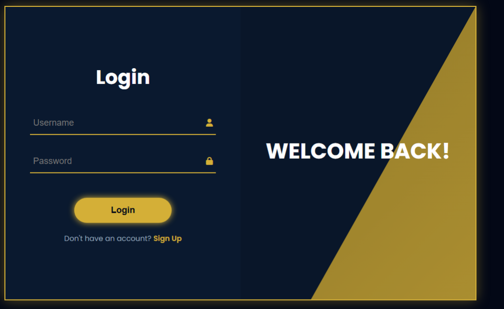

#  DigyNex Official Ecosystem

  
  
  

---

## 🌌 The Vision

DigyNex is more than a service provider; it's a **Digital Architecture**. This repository contains the unified ecosystem of DigyNex, ranging from high-conversion landing pages to complex Enterprise management systems.

### 🏗️ Ecosystem Components

| Module                    | Description                                                  | Live Access                                  |
| :------------------------ | :----------------------------------------------------------- | :------------------------------------------- |
| **Main Landing**          | The public face of DigyNex. High-performance, SEO-optimized. | [digynex.se](https://digynex.se)             |
| **Enterprise CMS**        | Advanced lead orchestration and client management portal.    | [cms.digynex.se](https://cms.digynex.se)     |
| **Tuition Manager (TMS)** | Specialized ERP for educational institutions.                | [tms.digynex.se](https://tms.digynex.se)     |
| **NFC Digital Card**      | Professional networking tool with lead capture.              | [digynex.se/card](https://digynex.se/card)   |
| **Architect Portfolio**   | The engineering philosophy behind the system.                | [amila.digynex.se](https://amila.digynex.se) |

---

## 🛠️ Technological Stack

Our architecture is built on the pinnacle of modern web technology:

- **Frontend:** HTML5, CSS3 (Custom Glassmorphism), Vue.js (Quasar Framework)
- **AI Engine:** Google Gemini Pro via n8n workflows
- **Data Layer:** Supabase (PostgreSQL)
- **Automation:** n8n Cloud Orchestration
- **Communications:** WhatsApp Business API Integration

---

## ⚡ Key Features

- **[Spinning Brand Identity]**: Living logo animation integrated across all touchpoints.
- **[Real-time AI Chat]**: Multi-language support (Sinhala/Swedish/English) powered by custom LLM workflows.
- **[Lead Capture & CRM]**: Seamless synchronization between WhatsApp, Web, and Supabase.
- **[Performance Optimized]**: Next-gen WebP assets and standardized CSS for ultimate speed.

---

## 👨‍💻 Architect

**Amila Perera**  
_Founder & Ecosystem Architect_  
Specialist in Digital Architecture, AI Systems, and Enterprise Solutions. With 18+ years of expertise in Telecom and Digital Strategy.

 
 

---

  <i>"Architecting the Digital Future."</i> 
  <b>© 2026 DigyNex Systems. Global Leaders in IT Transformation.</b>

