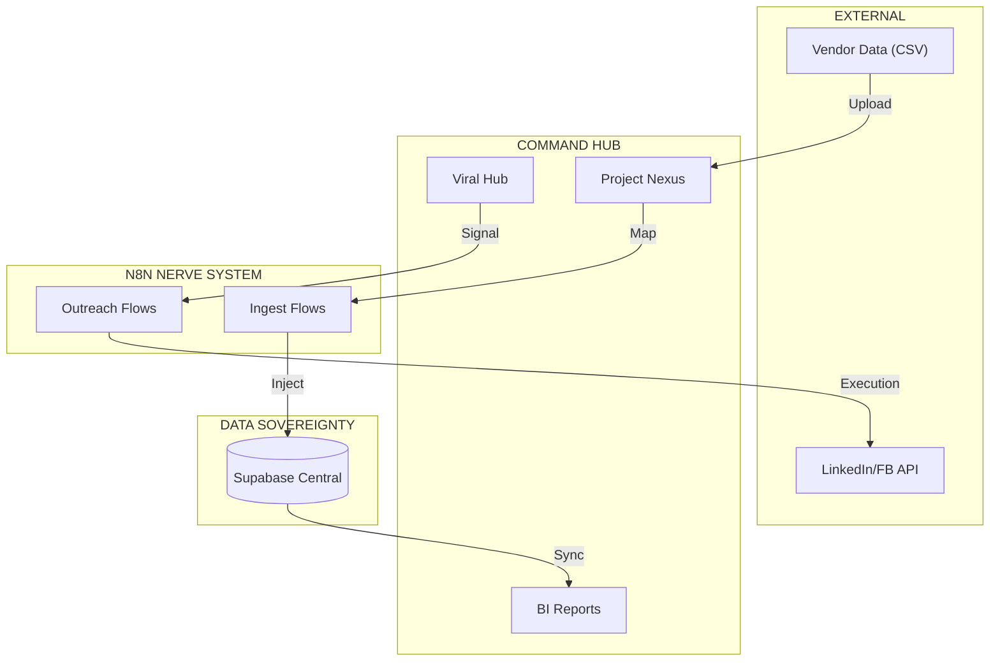

# 👑 DIGYNEX 360: THE INTERACTIVE FUNCTIONAL HANDBOOK
## "The Anatomy of Operational Sovereignty" (2026 Edition)

This handbook serves as the **Definitive Guide** for every interactive component within the DigyNex 360 Business Operating System. It explains the logic, data context, and intended outcome for every "Box" and "Tab" in the platform.

---

## 🌟 MODULE 01: PROJECT NEXUS (STRATEGIC HUB)
_Context: Long-term portfolio stewardship and executive decision logic._

### 🛠️ The Global Context Box (Project Selector)
- **Label:** "System Portfolio" vs. "Active Project [ID]"
- **What it does:** This is the **Master State Controller**. 
  - When **All Projects** is selected, every widget display aggregates the entire organizational ecosystem.
  - When a **Specific ID** is selected, the system performs a forensic drill-down into that specific project's lifecycle, filtering all KPIs and charts in real-time.

### 🧠 Tab 1: Strategic Intelligence
| Component (Box) | Operational Logic | Executive Outcome |
| :--- | :--- | :--- |
| **Budget Burn Rate** | Tracks $ spent vs. $ allocated via live finance hooks. | Prevents capital leakage and budget overruns. |
| **Schedule Variance** | Measures "Plan vs. Actual" physical progress in days. | Identifying project delays 14-30 days before they occur. |
| **Resource Density** | Counts active subcontractor clusters and personnel. | Ensures workforce availability for critical path tasks. |
| **Operational Risk** | AI-driven anomaly warning (Supply chain delays, cost spikes). | High-priority alerting for executive intervention. |
| **AI Project Rebalancer** | Interactive button that suggests resource sharding protocols. | Optimizes throughput by shifting resources from idle projects. |

### 🏗️ Tab 2: Advanced Milestone Health
- **Box: Phase Execution Pulse:** Shows hierarchical progress (Civil → Structural → MEP). 
- **What it does:** Allows the CEO to see exactly *which* layer of construction is causing the bottleneck.
- **Metric:** Completion vs. Burn Correlation (Are we 50% done but spent 70% of the money?).

### 📈 Tab 3: Portfolio Analytics
- **Box: Executive Variance Pulse:** Bar chart showing cost deviations per project sector.
- **Box: Strategic Burn Projection:** Predictive line chart estimating final project cost at completion.
- **Outcome:** Provides "Board Ready" visualizations for quarterly auditing.

### 📂 Tab 4: Bulk Ingest Hub (The Sovereignty Engine)
- **Box: Manifest Drop Zone:** Supports ingestion of 10,000+ items (CSV/PDF).
- **Automation:** The AI Mapping Engine converts external vendor data (AWR) into internal WBS identifiers automatically.

---

## 🚀 MODULE 02: AI SOCIAL VIRAL HUB (GROWTH HUB)
_Context: Advanced automated lead discovery and social outreach orchestration._

### 🎯 Tab 1: AI Social Viral Hub
| Component (Box) | Operational Logic | Executive Outcome |
| :--- | :--- | :--- |
| **Targeting Matrix** | Selection of source (LinkedIn/FB) and Minimum Growth Score. | Filters high-intent leads from social noise automatically. |
| **Global Matrix Scan** | Counts total active sessions and social data points analyzed. | Real-time visibility into the reach of the AI scanning engine. |
| **Viral Velocity** | Percentage-based growth of engagement per hour. | Identifying trending sectors for immediate tactical pivot. |
| **AI Intelligence Node** | Strategic text insights generated from social sentiment analysis. | Identifying market needs before they manifest as direct inquiries. |
| **Lead Feed (Discovery)** | High-density leads table with Growth Potential Score (50-100%). | Direct engagement queue for the sales team. |
| **AI Outreach Modal** | Drafts personalized messages using AI, sent via **n8n** webhooks. | High-speed outreach without manual platform-switching. |

### 🤖 Technical Sync: The n8n & Social Bridge
- **The Engine:** Every "Initiate Broadcast" command triggers a secure **n8n Workflow**. 
- **The Flow:** Vue UI → n8n Webhook → Social Platform (LinkedIn/FB) → Lead Capture (Supabase/CMS Sync).

---

## ⚙️ MODULE 03: OPERATIONS COMMAND (TACTICAL HUB)
_Context: High-speed production execution and forensic financial matching._

### 📡 Tab 1: Forensic AI Matching
- **Box: PO/Invoice Matcher:** AI reconciliation of inbound TMS invoices against active PO logs.
- **Goal:** Identifying "Phantom Charges" or billing errors before they hit the financial profit engine.

### 📊 Tab 2: Operational Log (Daily Transactions)
- **Box: Lifecycle Pulse:** A sequential timeline of every tactical event (PO -> WO -> Result).
- **Sync:** Real-time data sync with the **Transport Management System (TMS)**.

---

## 📊 MODULE 04: BI INTELLIGENCE (THE COMMAND CORE)
_Context: Global health monitoring and "Full Papare" manifest generation._

### 🎯 Tab 1: Platform Pulse
| Component (Box) | Operational Logic | Executive Outcome |
| :--- | :--- | :--- |
| **Target Benchmark** | Circular tracking of monthly/quarterly growth targets. | Immediate visibility into organizational goal alignment. |
| **Automation Pulse** | Real-time monitoring of 24+ active n8n automation nodes. | Ensures system-wide synchronization is 100% active. |
| **Net Profit Engine** | Dynamic calculation of Revenue minus multi-app Operational Burn. | Provides the true "Bottom Line" across all business units. |

### 📄 Tab 2: Custom Report Context Builder
- **Box: Metric Universe Selector:** Selects context (Revenue, Expense, Viral Leads).
- **Box: Neural Synthesis Toggle:** Injects AI-generated strategic summaries into the report.
- **Action: Generate Elite Manifest:** Produces a comprehensive PDF/ODF audit of the entire BOS.

---

## 📜 MODULE 05: PROJECT CRM (PARTNER HUB)
_Context: Client (CMS) management and relationship tracking._

### 🤝 Tab 1: Partner Registry
- **Box: Profile Matrix:** Directory of clients and subcontractors with performance scorecards.
- **Box: Commission Tracker:** Tracks 5-10% referral payouts for partner leads.
- **Sync:** Live sync with the **Client Management System (CMS)** for lead lifecycle tracking.

---

## 🛡️ MODULE 06: PERSONNEL SECURITY (IDENTITY HUB)
_Context: Governance and RBAC protection._

### 🔒 Tab 1: Security Clusters
- **Box: Identity Index:** Executive control over organizational roles (CEO, Manager, Finance).
- **Result:** Ensures zero unauthorized access to sensitive financial or project data.

---

## 📡 GLOBAL CROSS-APP SYNCHRONIZATION (CMS / TMS / AUTOMATE)
The DigyNex 360 BOS functions as the **Master Intelligence Overlay** for three core clusters:
1.  **Transport (TMS) Sync:** Daily logistics burn and vendor invoicing data is parsed into Module 03 (Operations).
2.  **Client (CMS) Sync:** Partner data and Viral Discovery leads are synchronized into Module 05 (CRM).
3.  **Automate (n8n) Sync:** All social outreach and report generation tasks are executed via secure automation nodes.

---

## 🏛️ SYSTEM BLUEPRINT: THE AUTOMATION MATRIX (WHITE SHEET)

---

## 📅 VERSION CONTROL & SYNC
- **Current Version:** v2.2.0 (Integrated AI Growth & Global Sync)
- **Sync Status:** 1:1 Parity with local source files and n8n Cluster alpha-10.

*© 2026 DigyNex Ecosystem | Master Functional Intelligence Division*
